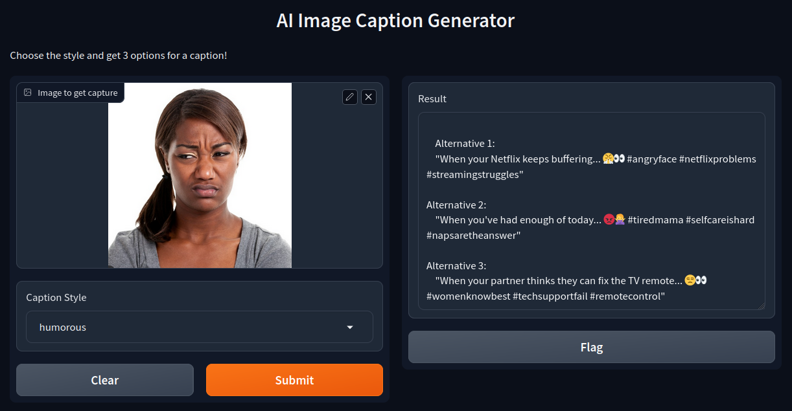

# AI Image Caption Generator

This project is a simple AI-powered image caption generator that utilizes two models: an image-to-text model and a 13-billion parameter LLaMA model to create humorous captions for images. The application is built using Gradio for the user interface.

## How It Works

1. **Image-to-Text Model**: Converts the input image into a textual description.
2. **LLaMA Model**: Generates humorous captions based on the textual description provided by the image-to-text model.
3. **Gradio Interface**: Provides a user-friendly interface for uploading images and displaying the generated captions.

## Example

